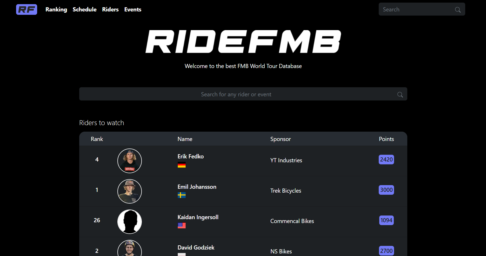
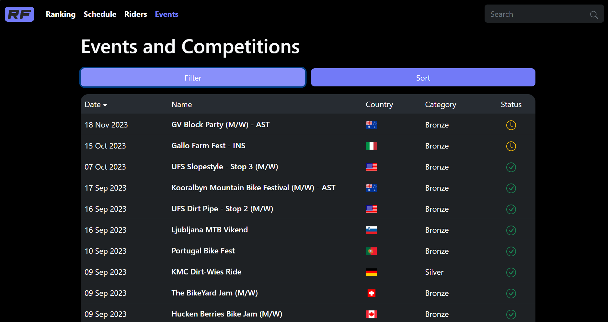
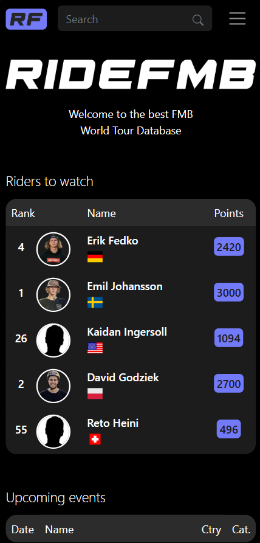
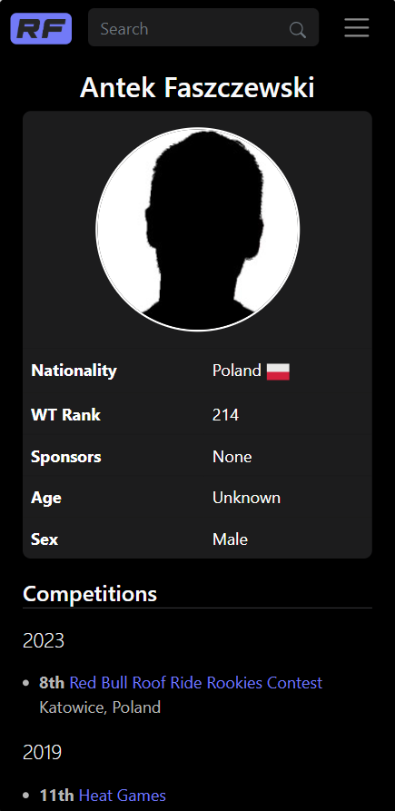
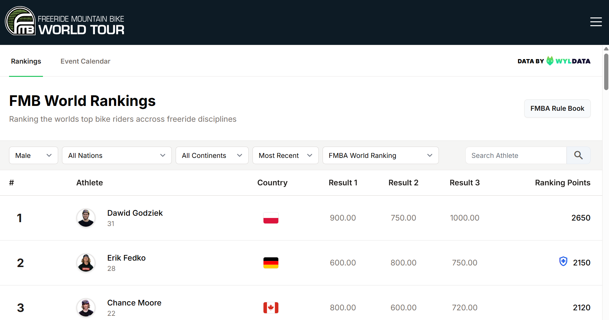

> **Update 2024:** the website is down. [Read more](#update)

# RideFMB

**RideFMB** (named after *Freeride Mountain Biking*) is a web application that acts as a database of riders and events from the **FMB World Tour** - the official international circuit of professional Dirt Jumping and Slopestyle competitions.

The [official FMB World Tour website](https://www.fmbworldtour.com/) is difficult to navigate: information is scattered, and there is no way to search or filter riders and events. RideFMB was built to fix that - an accessible, mobile-friendly site for quickly finding everything you want to know about the FMBWT.

## Website

You can find it here: https://tymsoncyferki.eu.pythonanywhere.com

<kbd></kbd>

## Data

Since the official FMBWT site does not expose an API, the database is populated and kept in sync via **web scraping**. Data freshness and accuracy therefore depend on the official site (around 90%), but RideFMB also offers extras the official one doesn't - rider age, personal descriptions, per-run points in particular events, and more.

## Features

### Home page

A landing page with a search bar for riders and events, a *"Riders to watch"* table highlighting riders in top form, and the five nearest upcoming events. The top navbar has four sections - **Ranking**, **Schedule**, **Riders**, **Events** - plus a search field. The footer holds links to the help page and the contact form.

### Ranking & Schedule

- **Ranking** - the current top 300 riders, 10 per view, showing position, photo, name, country, main sponsor, and the points used to rank them.
- **Schedule** - events from a given year sorted by date, with name, country, category, and a colored status (green = completed, yellow = upcoming, red = cancelled).

Every row links through to the detail page for that rider or event.

### Riders & Events

Both tabs list everything in the database - active *and* retired riders; past, current, and upcoming events - with rich filtering and sorting:

- **Riders:** filter by country, sex, or sponsor; sort alphabetically, by total points, current ranking position, or medal count.
- **Events:** filter by country, status, partners, year, series, category, or discipline; sort by date or name.

Filters and sort options live inside a `Modal` with collapsible dropdowns, so the interface stays clean and uncluttered.

<kbd></kbd>

### Rider & event detail pages

Each rider page shows nationality, rank, social media, all sponsors, and a per-season list of events the rider competed in. Each event page shows the category, precise location, prize, partners, results, and links to other events in the same series (e.g. previous editions of the same competition).

### Mobile-first

The whole app is optimized for mobile devices: tables are trimmed to fit phone widths without losing readability, the top navbar collapses to a menu button and a search field, and the color palette and interactions stay consistent across breakpoints.

<kbd>   </kbd>
  &nbsp;&nbsp;
  <kbd>  </kbd>

### Why use RideFMB instead of the official site?

- Mobile responsiveness
- Easy search for riders and events
- Rich filtering and sorting
- More natural site navigation
- Better SEO (hopefully!)

 

---

### Update 2024

One year after launching my app, the official website was rebuilt. They added the same set of features my app offered.

<kbd></kbd>

Since then, it no longer made sense to keep my app alive. My scraping algorithm would also have to be rewritten, as the whole layout and routes had changed.
